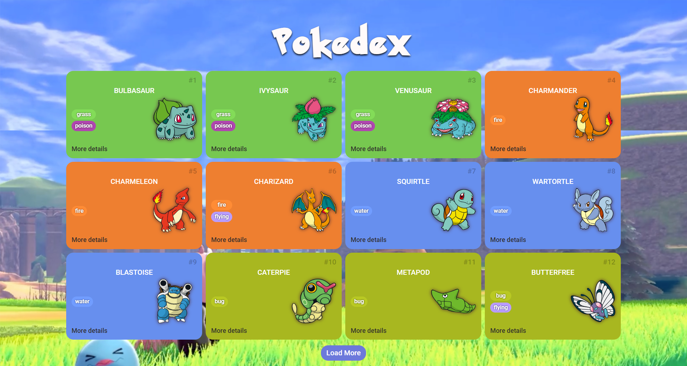
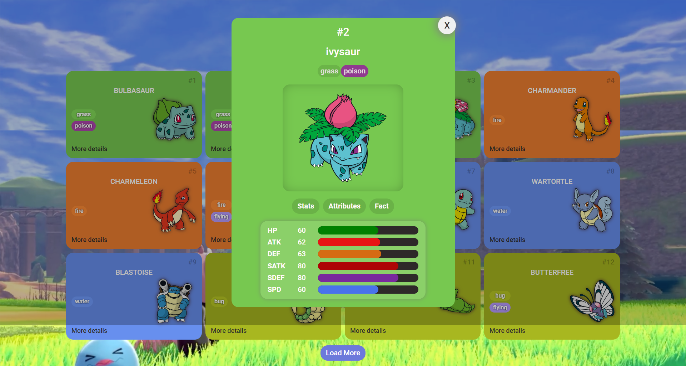

<h1 align="center" style="font-family:'Pokemon Solid'; font-size:4rem">
  Pokedex
</h1>

<div align="center">
  <h2>Pokedex</h2>
  
  <h2>Pokemon Details</h2>
  
</div>

<p align="center">
  <a href="#project">Project</a>&nbsp;&nbsp;&nbsp;|&nbsp;&nbsp;&nbsp;
  <a href="#-technologies">Technologies</a>&nbsp;&nbsp;&nbsp;|&nbsp;&nbsp;&nbsp;
  <a href="#-Getting started">Getting started</a>&nbsp;&nbsp;&nbsp;|&nbsp;&nbsp;&nbsp;
  <a href="#-layout">Layout</a>&nbsp;&nbsp;&nbsp;|&nbsp;&nbsp;&nbsp;
  <a href="#-license">License</a>
</p>

<br>

<p align="center">
  
</p>


## 💻 Projeto

Desafio de código para o Bootcamp Coding The Future Banco PAN - Desenvolvimento Frontend com Angular, onde foi proposto que desenvolvêssemos uma Pokedex com os detalhes de cada pokemon.


## 🧪 Technologies

This project was developed using the following technologies:
 
- [HTML](https://developer.mozilla.org/pt-BR/docs/Web/HTML)
- [CSS](https://developer.mozilla.org/pt-BR/docs/Web/CSS)
- [JS](https://developer.mozilla.org/pt-BR/docs/Web/JavaScript)

## 🚀 Getting started

Clone the project and access the folder.

```bash
$ git clone https://github.com/MaykonRaphael/pokedex.git
$ cd pokedex
```

Open the index.html in your browser.

## 🔖 Layout

You also can view the project in your browser through the links below:
- [Netlify](https://pokedex-maykonraphael.netlify.app/)

## 📝 License

This project is licensed under the MIT License. See the [LICENSE](LICENSE.md) file for details.

---
<p align="center">
  Made by Maykon Raphael 👋
</p>